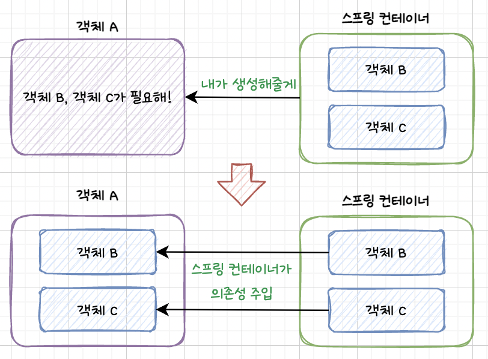

# Spring DI

## Spring DI (Dependency Injection)
스프링에서 의존성 주입은, 각 객체 간의 의존성을 스프링 컨테이너가 자동으로 연결해줌을 의미합니다.



만약 스프링 DI를 사용하지 않는다면 어떻게 될까요?

예를 들어 A 클래스 내부에서 B 클래스와 C 클래스를 활용한다고 할 때,
아래와 같이 A 클래스 내부에서 B 클래스와 C 클래스를 생성해서 사용하도록 구성했다고 합시다.

```java
public class A {
    private B b;
    private C c;
    
    public A() {
        b = new B();
        c = new C();
    }
}
```

이렇게 생성한 경우, B 클래스나 C 클래스에 변경사항이 발생하면, A 클래스에 수정이 필요하게 됩니다.
이러한 코드를 결합도가 높은 코드라고 표현하며,
A 클래스는 B 클래스와 C 클래스에 의존성을 가진다고 표현합니다.

**스프링 DI는 이러한 의존성을 외부에서 주입하여 결합도를 낮춰줍니다.**

```java
public class A {
    @Autowired
    private B b;
    @Autowired
    private C c;
}
```

## Spring DI 구현 방법

### 1. 필드 주입 (Field Injection)

필드 주입은 의존성을 주입하고 싶은 필드에 @Autowired 애노테이션을 붙여주면 의존성이 주입됩니다.

```java
public class A {
    @Autowired
    private B b;
    @Autowired
    private C c;
}
```

#### 특징
- 코드가 간결합니다.
- 필드에 final 키워드를 사용할 수 없어 불변성을 활용할 수 없습니다.

여러 블로그를 읽어보면 SRP 위반이나 보이지 않는 의존성에 대해 나오는데,
아래 링크를 걸어둔 블로그를 읽어보면
이는 필드 주입만의 문제가 아닐 수 있다는 생각이 들어 특징에서 제외했습니다.

[[Spring] DI(Dependency Injection) 정리](https://velog.io/@znftm97/Spring-DIDependency-Injection-%EC%A0%95%EB%A6%AC)

> 참고로, 인텔리제이에서 필드 주입 사용 시 경고창이 나옵니다.

#### 빈을 주입하는 순서
1. 주입 받으려는 빈의 생성자를 호출하여 빈을 찾거나 빈 팩토리에 등록합니다.
2. 생성자 인자에 사용하는 빈을 찾거나 생성합니다.
3. 필드에 주입합니다.

필드 주입 방식은 런타임에서 의존성을 주입하기 때문에
의존성을 주입하지 않아도 객체가 생성될 수 있습니다.
```java
public class App {
    public static void main(String[] args) {
        A a = new A(); // 의존성을 주입하지 않았지만 컴파일 에러는 발생하지 않음
    }
}
```

### 2. 수정자 주입 (Setter Based Injection)
수정자 주입은 setter 메서드에 @Autowired 애노테이션을 붙여 의존성을 주입하는 방식입니다.
선택, 변경 가능성이 있는 의존관계에 사용하는 게 좋으며,
자바 빈 프로퍼티 규약의 수정자 메서드 방식을 사용하는 방법입니다.

```java
public class A {
    private B b;
    private C c;
    
    @Autowired
    public void setB(B b) {
        this.b = b;
    }

    @Autowired
    public void setC(C c) {
        this.c = c;
    }
}
```

#### 특징
- 선택, 변경 가능성이 있는 의존관계에 사용하는 것이 좋습니다.
- 자바빈 프로퍼티 규약의 수정자 메서드 방식을 사용하는 방법입니다. (setXxx)
- 필드에 final 키워드를 사용할 수 없어 불변성을 활용할 수 없습니다.
- 선택적으로 주입할 수 있기 때문에 누락 가능성이 있으며, 누락 시 NPE 가 발생합니다.

#### 빈을 주입하는 순서
1. 주입 받으려는 빈의 생성자를 호출하여 빈을 찾거나 빈 팩토리에 등록합니다.
2. 생성자 인자에 사용하는 빈을 찾거나 생성합니다.
3. 주입하려는 빈 객체의 수정자를 호출하여 주입합니다.

필드 주입 방식과 마찬가지로, 수정자 주입 방식도 런타임에서 의존성을 주입하기 때문에 의존성을 주입하지 않아도 객체가 생성될 수 있습니다.
```java
public class App {
    public static void main(String[] args) {
        A a = new A(); // 의존성을 주입하지 않았지만 컴파일 에러는 발생하지 않음
    }
}
```

#### 3. 생성자 주입 (Constructor Based Injection)
생성자 주입은 생성자를 사용하여 의존성을 주입하는 방식입니다.

```java
public class A {
    private final B b;
    private final C c;

    @Autowired // 생성자가 딱 하나만 존재하는 경우, @Autowired 를 생략해도 자동 주입된다.
    public A(B b, C c) {
        this.b = b;
        this.c = c;
    }
}
```

또한, Lombok 라이브러리에서 제공하는 @RequiredArgsConstructor 기능을 사용하면
final 이 붙은 필드를 모아서 생성자를 자동으로 만들어주기 때문에,
필드 주입처럼 간단하게 사용할 수 있습니다.

```java
@RequiredArgsConstructor
public class A {
    private final B b;
    private final C c;
}
```

#### 특징
- 필드에 final 키워드를 사용할 수 있어 불변성을 활용할 수 있습니다. <br/>
  (객체 생성 시 딱 1번 호출되므로 이후 변경될 일 X)
- 객체가 생성되는 시점에 빈을 주입하기 때문에 NPE 발생을 막습니다.

#### 빈을 주입하는 순서
1. 생성자의 인자에 사용되는 빈을 찾거나 빈 팩토리에서 생성합니다.
2. 찾은 인자 빈으로 주입하려는 생성자를 호출합니다.

객체가 생성되는 시점에 빈을 주입하기 때문에 의존성을 주입하지 않으면 컴파일 에러가 발생하게 됩니다.
```java
public class App {
    public static void main(String[] args) {
        // AS-IS : 의존성을 주입하지 않아 컴파일 에러가 발생함
        A a = new A();
    }
}

public class App {
    public static void main(String[] args) {
        // TO-BE : 의존성 주입
        B b = new B();
        C c = new C();
        A a = new A(b, c);
    }
}
```


## 🔗 참고
- [[TI/SPRING] IOC, DI 정의/장점](https://isoomni.tistory.com/entry/TISPRING-IOC-DI-%EC%A0%95%EC%9D%98-%EC%9E%A5%EC%A0%90)
- [[Spring Framework] DI, IoC 그리고 의존성 주입(DI)의 3가지 방법](https://nect2r.tistory.com/58)
- [DI(의존성 주입)이란?](https://m.blog.naver.com/PostView.nhn?blogId=ljh0326s&logNo=221395815870&proxyReferer=https:%2F%2Fwww.google.com%2F)
- [스프링 핵심 원리 기본편](https://www.inflearn.com/course/%EC%8A%A4%ED%94%84%EB%A7%81-%ED%95%B5%EC%8B%AC-%EC%9B%90%EB%A6%AC-%EA%B8%B0%EB%B3%B8%ED%8E%B8)
- [[Spring] DI(Dependency Injection) 정리](https://velog.io/@znftm97/Spring-DIDependency-Injection-%EC%A0%95%EB%A6%AC)
